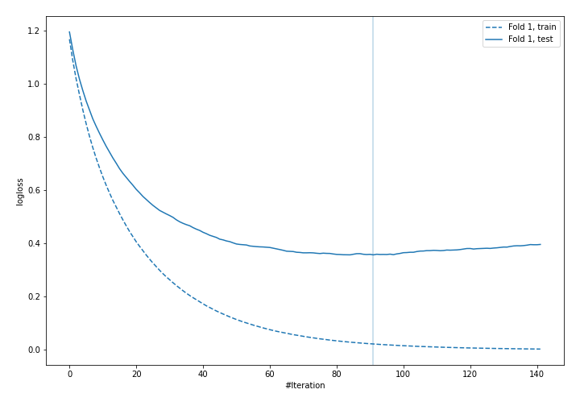
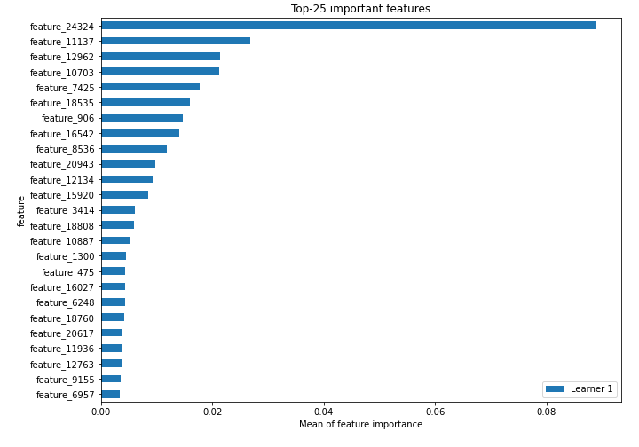
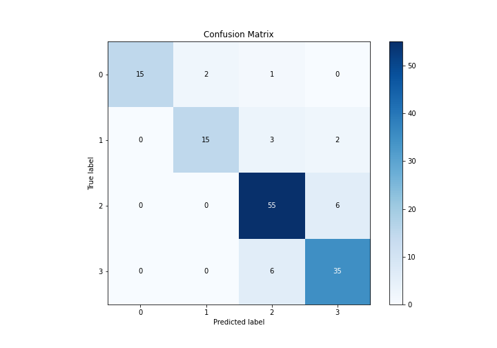
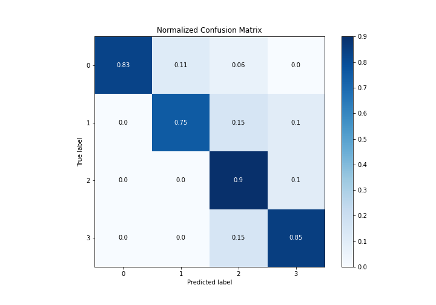
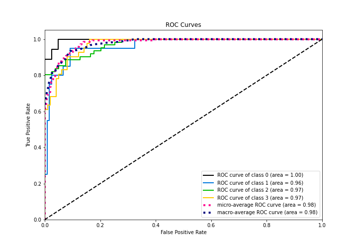
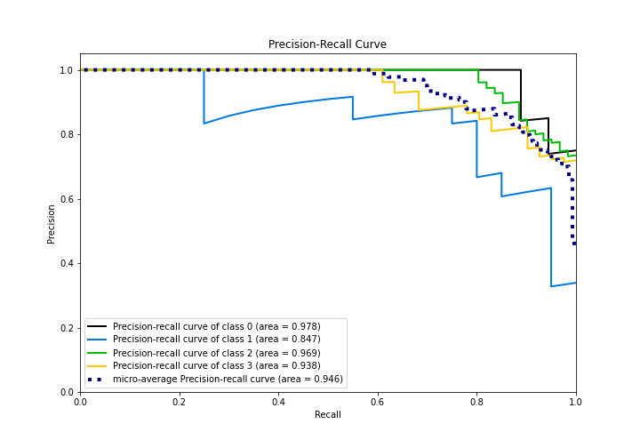

# Summary of 11_LightGBM

[<< Go back](../README.md)

## LightGBM
- **n_jobs**: -1
- **objective**: multiclass
- **num_leaves**: 15
- **learning_rate**: 0.05
- **feature_fraction**: 0.8
- **bagging_fraction**: 0.5
- **min_data_in_leaf**: 50
- **metric**: multi_logloss
- **custom_eval_metric_name**: None
- **num_class**: 4
- **explain_level**: 2

## Validation
 - **validation_type**: split
 - **train_ratio**: 0.9
 - **shuffle**: True
 - **stratify**: True

## Optimized metric
logloss

## Training time

2746.7 seconds

### Metric details
|           |         0 |         1 |         2 |         3 |   accuracy |   macro avg |   weighted avg |   logloss |
|:----------|----------:|----------:|----------:|----------:|-----------:|------------:|---------------:|----------:|
| precision |  1        |  0.882353 |  0.846154 |  0.813953 |   0.857143 |    0.885615 |       0.861675 |   0.35717 |
| recall    |  0.833333 |  0.75     |  0.901639 |  0.853659 |   0.857143 |    0.834658 |       0.857143 |   0.35717 |
| f1-score  |  0.909091 |  0.810811 |  0.873016 |  0.833333 |   0.857143 |    0.856563 |       0.857146 |   0.35717 |
| support   | 18        | 20        | 61        | 41        |   0.857143 |  140        |     140        |   0.35717 |

## Confusion matrix
|              |   Predicted as 0 |   Predicted as 1 |   Predicted as 2 |   Predicted as 3 |
|:-------------|-----------------:|-----------------:|-----------------:|-----------------:|
| Labeled as 0 |               15 |                2 |                1 |                0 |
| Labeled as 1 |                0 |               15 |                3 |                2 |
| Labeled as 2 |                0 |                0 |               55 |                6 |
| Labeled as 3 |                0 |                0 |                6 |               35 |

## Learning curves

## Permutation-based Importance

## Confusion Matrix

## Normalized Confusion Matrix

## ROC Curve

## Precision Recall Curve

[<< Go back](../README.md)
