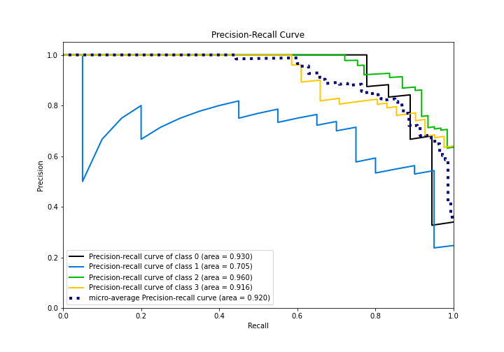

# Summary of 1_Default_LightGBM

[<< Go back](../README.md)

## LightGBM
- **n_jobs**: -1
- **objective**: multiclass
- **num_leaves**: 63
- **learning_rate**: 0.05
- **feature_fraction**: 0.9
- **bagging_fraction**: 0.9
- **min_data_in_leaf**: 10
- **metric**: multi_logloss
- **custom_eval_metric_name**: None
- **num_class**: 4
- **explain_level**: 2

## Validation
 - **validation_type**: split
 - **train_ratio**: 0.9
 - **shuffle**: True
 - **stratify**: True

## Optimized metric
logloss

## Training time

3580.5 seconds

### Metric details
|           |         0 |    1 |         2 |         3 |   accuracy |   macro avg |   weighted avg |   logloss |
|:----------|----------:|-----:|----------:|----------:|-----------:|------------:|---------------:|----------:|
| precision |  1        |  0.7 |  0.870968 |  0.782609 |   0.828571 |    0.838394 |       0.837257 |  0.462574 |
| recall    |  0.666667 |  0.7 |  0.885246 |  0.878049 |   0.828571 |    0.78249  |       0.828571 |  0.462574 |
| f1-score  |  0.8      |  0.7 |  0.878049 |  0.827586 |   0.828571 |    0.801409 |       0.8278   |  0.462574 |
| support   | 18        | 20   | 61        | 41        |   0.828571 |  140        |     140        |  0.462574 |

## Confusion matrix
|              |   Predicted as 0 |   Predicted as 1 |   Predicted as 2 |   Predicted as 3 |
|:-------------|-----------------:|-----------------:|-----------------:|-----------------:|
| Labeled as 0 |               12 |                6 |                0 |                0 |
| Labeled as 1 |                0 |               14 |                3 |                3 |
| Labeled as 2 |                0 |                0 |               54 |                7 |
| Labeled as 3 |                0 |                0 |                5 |               36 |

## Learning curves

## Permutation-based Importance

## Confusion Matrix

## Normalized Confusion Matrix

## ROC Curve

## Precision Recall Curve

[<< Go back](../README.md)
