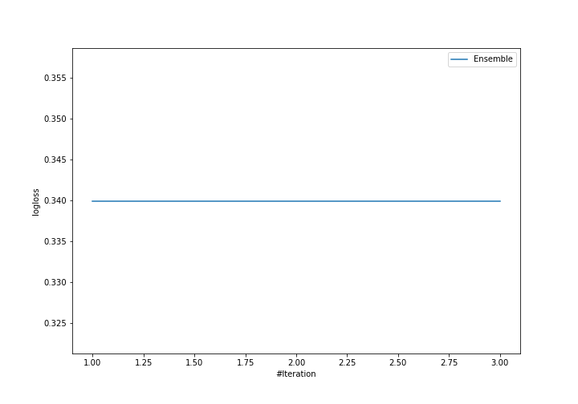

# Summary of Ensemble

[<< Go back](../README.md)

## Ensemble structure
| Model       |   Weight |
|:------------|---------:|
| 12_LightGBM |        1 |

### Metric details
|           |         0 |         1 |         2 |         3 |   accuracy |   macro avg |   weighted avg |   logloss |
|:----------|----------:|----------:|----------:|----------:|-----------:|------------:|---------------:|----------:|
| precision |  1        |  0.875    |  0.857143 |  0.782609 |       0.85 |    0.878688 |       0.856233 |  0.339918 |
| recall    |  0.833333 |  0.7      |  0.885246 |  0.878049 |       0.85 |    0.824157 |       0.85     |  0.339918 |
| f1-score  |  0.909091 |  0.777778 |  0.870968 |  0.827586 |       0.85 |    0.846356 |       0.849852 |  0.339918 |
| support   | 18        | 20        | 61        | 41        |       0.85 |  140        |     140        |  0.339918 |

## Confusion matrix
|              |   Predicted as 0 |   Predicted as 1 |   Predicted as 2 |   Predicted as 3 |
|:-------------|-----------------:|-----------------:|-----------------:|-----------------:|
| Labeled as 0 |               15 |                2 |                1 |                0 |
| Labeled as 1 |                0 |               14 |                3 |                3 |
| Labeled as 2 |                0 |                0 |               54 |                7 |
| Labeled as 3 |                0 |                0 |                5 |               36 |

## Learning curves

## Confusion Matrix

## Normalized Confusion Matrix

## ROC Curve

## Precision Recall Curve

[<< Go back](../README.md)
