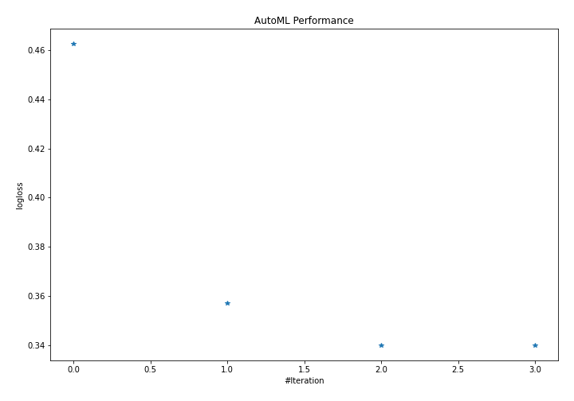
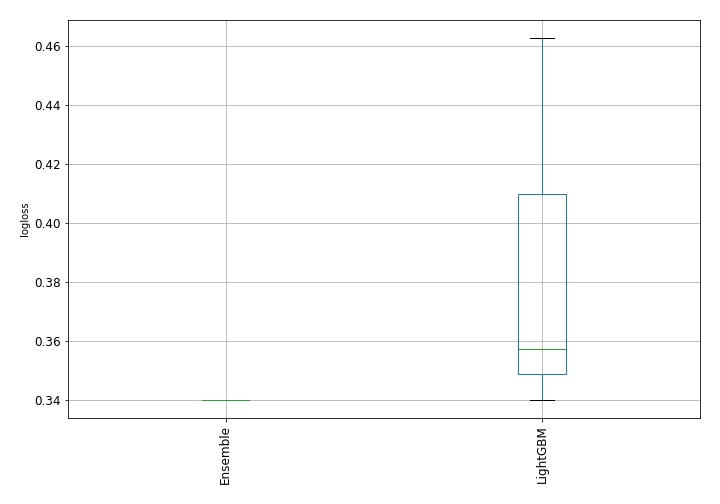
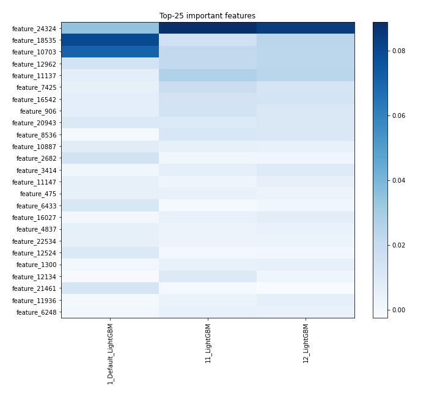
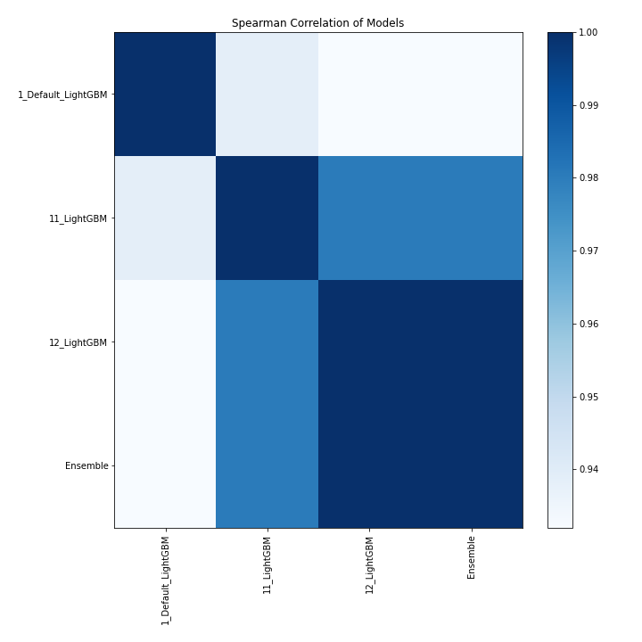

# AutoML Leaderboard

| Best model   | name                                               | model_type   | metric_type   |   metric_value |   train_time |
|:-------------|:---------------------------------------------------|:-------------|:--------------|---------------:|-------------:|
|              | [1_Default_LightGBM](1_Default_LightGBM/README.md) | LightGBM     | logloss       |       0.462574 |      3582.49 |
|              | [11_LightGBM](11_LightGBM/README.md)               | LightGBM     | logloss       |       0.35717  |      2747.43 |
| **the best** | [12_LightGBM](12_LightGBM/README.md)               | LightGBM     | logloss       |       0.339918 |      2619.86 |
|              | [Ensemble](Ensemble/README.md)                     | Ensemble     | logloss       |       0.339918 |         0.15 |

### AutoML Performance

### AutoML Performance Boxplot

### Features Importance

### Spearman Correlation of Models

