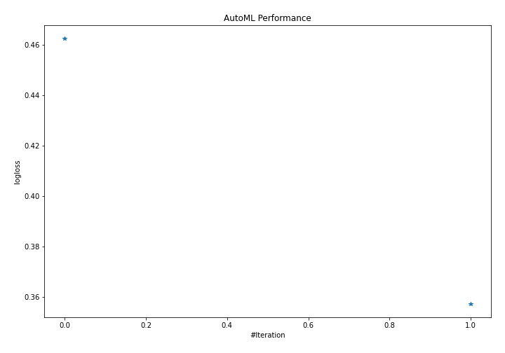

# AutoML Leaderboard

| Best model   | name                                               | model_type   | metric_type   |   metric_value |   train_time |   single_prediction_time |
|:-------------|:---------------------------------------------------|:-------------|:--------------|---------------:|-------------:|-------------------------:|
|              | [1_Default_LightGBM](1_Default_LightGBM/README.md) | LightGBM     | logloss       |       0.462574 |      1477.68 |                  12.6808 |
| **the best** | [2_LightGBM](2_LightGBM/README.md)                 | LightGBM     | logloss       |       0.35717  |      2857.96 |                  12.9719 |

### AutoML Performance

### AutoML Performance Boxplot

### Spearman Correlation of Models

